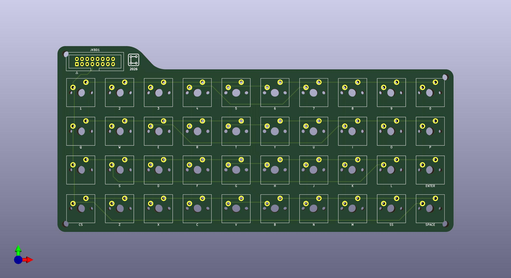
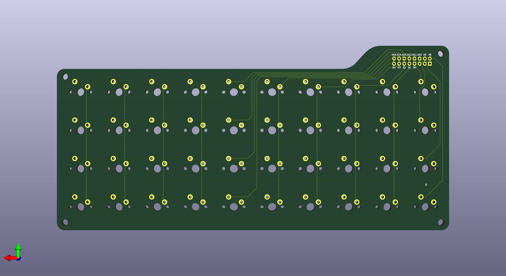

# ZX-Spectrum-MX-Keyboard-PCB

A simple, open-source PCB for the ZX Spectrum keyboard, designed to accept Cherry MX-compatible mechanical switches. This is not a drop-in replacement — it is intended for custom builds, modding experiments, and quick prototyping where you want tactile, clicky, or linear switches instead of the original rubber membrane.

---

## Overview

The ZX Spectrum had one of the most iconic (and infamous) keyboards in home computing history — a flat rubber membrane that is both a design classic and a frustration to type on. This PCB lets you replace it with proper mechanical switches while keeping the original 40-key matrix layout intact.

The design is deliberately minimal: a passive key matrix, a standard pin header connector, and nothing else. No microcontroller, no firmware, no complexity. Hook it up to whatever controller or original hardware you are interfacing with.

**Key layout — 40 keys, 4 rows × 10 columns:**

| Row | Keys |
|-----|------|
| 1 | `1` `2` `3` `4` `5` `6` `7` `8` `9` `0` |
| 2 | `Q` `W` `E` `R` `T` `Y` `U` `I` `O` `P` |
| 3 | `A` `S` `D` `F` `G` `H` `J` `K` `L` `ENTER` |
| 4 | `CS` `Z` `X` `C` `V` `B` `N` `M` `SS` `SPACE` |

---

## Features

- Cherry MX footprint for every key (compatible with MX clones)
- Passive key matrix — no microcontroller on board
- Standard 2-row pin header connector (JKBD1) for matrix rows and columns
- 4 mounting holes at the corners
- Rounded PCB edges

---

## How to Use

1. **Order the PCB** — download the Gerber files and send them to your preferred PCB manufacturer (JLCPCB, PCBWay, etc.). Standard 2-layer 1.6mm FR4 is fine.
2. **Solder the pin header** — standard 2.54mm pitch.
3. **Solder the switches** — snap in your Cherry MX (or compatible) switches and solder.
4. **Connect** — wire the pin header to your ZX Spectrum / Clone mainboard and have fun.

[📦 Download Gerbers](_tastatura_zx_.zip)

---

## Compatibility

This PCB is designed for **custom and experimental builds**. It is not a drop-in replacement for the original ZX Spectrum membrane. The physical dimensions and connector position have been chosen for general usability, not to match the original chassis mounting points exactly.

It is compatible with:
- ZX Spectrum 48K custom builds
- Any project that reads a 5×8 ZX Spectrum-compatible key matrix

---

## License

This project is open-source hardware released under the [CERN Open Hardware Licence v2 - Permissive (CERN-OHL-P)](https://ohwr.org/cern_ohl_p_v2.txt).

You are free to use, modify, and manufacture this design for personal or commercial purposes with attribution.

---

## Author

Designed by [r0b0t1cu](https://github.com/r0b0t1cu) — 2026
